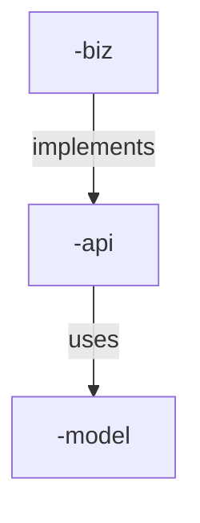

# API Wiser Maven Archetype

## Overview

The API Wiser Maven Archetype is a template generator that creates a new Maven project with OpenAPI schema management capabilities. This archetype provides a standardized project structure for developing API-driven applications. 

## Usage

### Creating a New Project

To create a new project using this archetype, use the following Maven command:

```shell
mvn archetype:generate -B \
  -DarchetypeGroupId=org.metalib.api.wiser \
  -DarchetypeArtifactId=api-wiser-archetype \
  -DarchetypeVersion=0.0.12 \
  -DgroupId='<your-group-id>' \
  -DartifactId='<your-artifact-id>' \
  -Dversion='<your-version>' \
  -Dopenapi=`<path-to-openapi-spec-file>`
```

Parameters:
- `archetypeGroupId`: org.metalib.api.wiser
- `archetypeArtifactId`: api-wiser-archetype
- `archetypeVersion`: Current version is `0.0.2`
- `groupId`: Your project's group identifier. 
   > The `groupId` name should follow Java package naming convention.
- `artifactId`: Your project's artifact name
- `version`: Your project's version
- `openapi`: path to an openapi spec file

It generates a multi-module Maven project for the provided openapi spec:
* `<your-artifact-id>-model` module - Contains the data models for the Museum API.
* `<your-artifact-id>-api` module - Contains the API definitions and OpenAPI specification.
* `<your-artifact-id>-biz` module - Contains business logic for the API.


