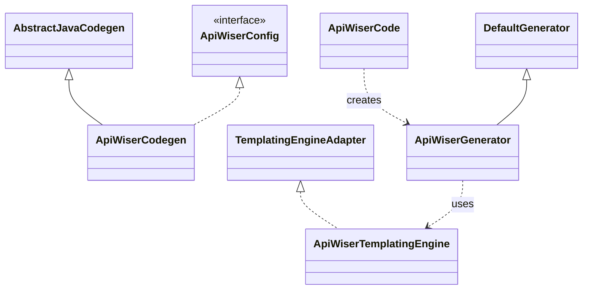

# API Wiser Core

## Overview

API Wiser Core is a foundational module that provides the essential functionality for API development within the API Wiser ecosystem. It serves as the central component containing common utilities, base configurations, and shared components.

The primary responsibility of this module is to drive the conversion of OpenAPI specifications into Java code. It offers a flexible and customizable framework for code generation, allowing developers to tailor the output to their specific needs.

> **NOTE:** API Wiser template implementations must not use this module as a dependency.

## Code Generation Workflow

The code generation process in `api-wiser-core` is designed to be flexible and extensible. The workflow is orchestrated by a few key components that work together to parse an OpenAPI specification, apply custom configurations, and generate code using templates.

1. **Configuration**: The process begins with `ApiWiserCodegen`, which contains the configuration for code generation. This includes details like package names, model naming conventions, and other customizations.
2.  **Execution**: The `ApiWiserCode` builder is used to configure and create an `ApiWiserGenerator` instance.
3.  **Generation**: The `ApiWiserGenerator` takes the OpenAPI specification and, guided by the `ApiWiserCodegen` configuration, generates the code.
4.  **Templating**: During generation, the `ApiWiserTemplatingEngine` is responsible for processing the templates (e.g., Mustache templates) to produce the final code.

### Key Components

The following class diagram illustrates the relationships between the main components involved in the code generation process.

## Model Classes

The core module also defines several model classes that are used to hold data and context during the code generation process.
* **`ApiWiserModel`**: A utility class for creating and manipulating API Wiser model objects. It provides convenient methods to convert maps into specific API Wiser model objects, simplifying the handling of model data.
* **`ApiWiserContext`**: Represents the context for API Wiser operations. It is primarily used to hold information about Maven dependencies, organized by category, which can be injected into the templates.
* **`ApiWiserPath`**: Represents a path in the API Wiser system, containing context information for different modules. It holds a map of module contexts, where each context can have its own set of imports and properties.
