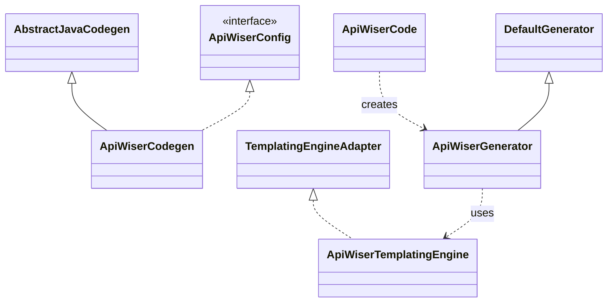

# api-wiser-core - API Wiser Core

## Overview

API Wiser Core is a foundational module that provides essential functionality for API development.
This module serves as the core component containing common utilities, base configurations, and shared 
components used across the API Wiser ecosystem.

The core module is responsible for converting OpenAPI specifications into Java code, providing
a flexible and customizable code generation framework.

> NOTE: API Wiser template implementation must not use this module as a dependency.

## Key Components

### Code Generation

* `ApiWiserCodegen` - A generator configuration implementation that extends OpenAPI Tools' AbstractJavaCodegen.
  It configures and customizes the code generation process for Java code generated from OpenAPI specifications.

* `ApiWiserCode` - A builder class for creating and configuring ApiWiserGenerator instances.
  It provides a fluent interface for setting various configuration options for code generation.

* `ApiWiserGenerator` - A code generator that extends OpenAPI Tools' DefaultGenerator.
  It generates code from OpenAPI specifications based on the configuration provided by ApiWiserCodegen.

* `ApiWiserTemplatingEngine` - A templating engine adapter that implements OpenAPI Tools' TemplatingEngineAdapter.
  It handles templates in the API Wiser system, loading and managing templates from ApiWiserTemplates.

### Model Classes

* `ApiWiserModel` - A utility class for creating and manipulating API Wiser model objects.
  It provides methods to convert maps to specific API Wiser model objects.

* `ApiWiserContext` - Represents a context for API Wiser operations.
  It holds information about Maven dependencies organized by category.

* `ApiWiserPath` - Represents a path in the API Wiser system with context information for different modules.
  It contains a map of module contexts where each context has imports and properties.

