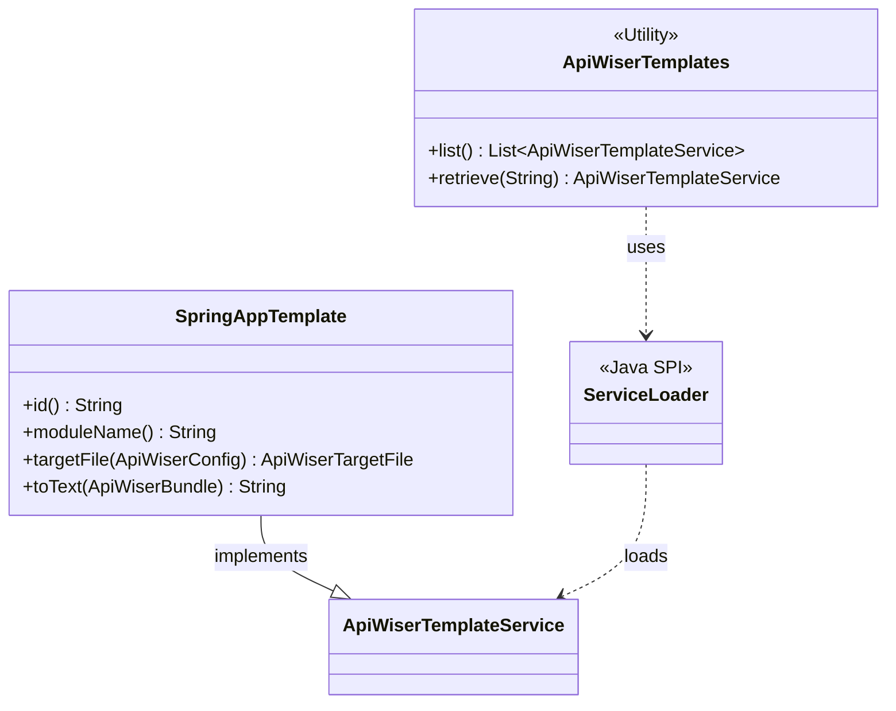

# API Wiser Spring App Templates

## Overview

The `api-wiser-spring-app-templates` module provides a set of templates for scaffolding a Spring Boot application within the API Wiser framework. It leverages the Java Service Provider Interface (SPI) through the `ApiWiserTemplateService` interface to enable the dynamic discovery of templates.

The primary purpose of this module is to automate the generation of common application components, such as the main `SpringApp` class, ensuring a consistent and standardized project structure. By using these templates, developers can quickly bootstrap a new service with all the necessary boilerplate code, allowing them to focus on business logic rather than setup.

## Class Diagram

The core of the templating engine is the `ApiWiserTemplateService` interface. This module provides concrete implementations for generating specific parts of a Spring Boot application.




## How It's Used

This module is designed to be used as a dependency for the `api-wiser-maven-plugin`. To use the templates, you need to add this module as a dependency to the plugin in your project's `pom.xml`.

The `api-wiser-maven-plugin` will then automatically discover and apply the templates during the `initialize` phase of the Maven build lifecycle.

### Example `pom.xml` Configuration:

```xml
    <plugin>
        <groupId>org.metalib.api.wiser</groupId>
        <artifactId>api-wiser-maven-plugin</artifactId>
        <version>${api-wiser.version}</version>
        <executions>
            <execution>
                <phase>initialize</phase>
                <goals>
                    <goal>sync</goal>
                </goals>
            </execution>
        </executions>
        <dependencies>
            <dependency>
                <groupId>org.metalib.api.wiser</groupId>
                <artifactId>api-wiser-maven-templates</artifactId>
                <version>${api-wiser.version}</version>
            </dependency>
            <dependency>
                <groupId>org.metalib.api.wiser</groupId>
                <artifactId>api-wiser-spring-app-templates</artifactId>
                <version>${api-wiser.version}</version>
            </dependency>
        </dependencies>
    </plugin>
```
