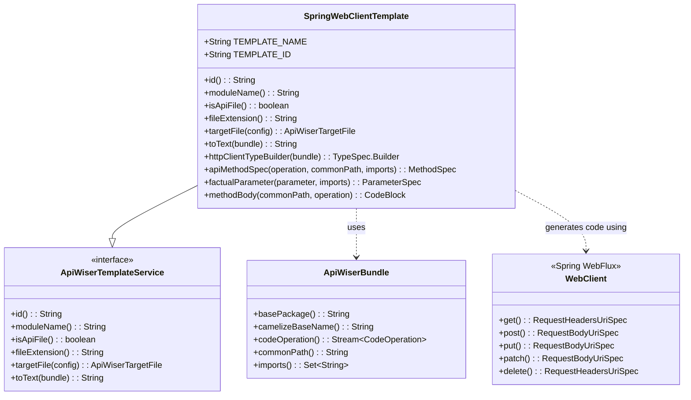

# API Wiser Spring WebClient Template

## Overview

The `api-wiser-spring-webclient-template` module is a specialized code generation template within the API Wiser ecosystem 
that generates Spring WebFlux-based HTTP client implementations. This template generates reactive HTTP clients that 
utilize Spring's WebClient for making HTTP requests, providing full support for various HTTP methods, path parameters, 
query parameters, and request/response body handling.

### Key Features

- **Reactive HTTP Client Generation**: Creates Spring WebFlux-based HTTP clients using WebClient
- **Full HTTP Method Support**: Handles GET, POST, PUT, PATCH, DELETE operations
- **Parameter Handling**: Supports path parameters, query parameters, and request bodies
- **Response Processing**: Handles both single objects and collections with proper type conversion
- **Error Handling**: Built-in HTTP status code and exception handling
- **Jackson Integration**: Uses Jackson for JSON serialization/deserialization
- **Lombok Integration**: Leverages Lombok annotations for cleaner code generation

## Architecture & Design

### Essential Class Diagram



### Core Components
1. **SpringWebClientTemplate**: The main template class responsible for generating Spring WebClient-based HTTP clients
2. **Method Generation**: Creates reactive methods that correspond to API operations
3. **Parameter Processing**: Handles different parameter types (path, query, body)
4. **Response Handling**: Manages both single object and collection responses
5. **Error Management**: Implements proper error handling for HTTP operations

## Usage in Project Context
This module is integrated into the API Wiser code generation pipeline and serves as a template provider for generating Spring WebFlux-based HTTP clients. Here's how it fits into the overall architecture:

### Integration Points
1. **Template Registration**: The module registers itself as a service provider through the `META-INF/services` mechanism
2. **Maven Plugin Integration**: Works seamlessly with the for automated code generation `api-wiser-maven-plugin`
3. **OpenAPI Processing**: Consumes OpenAPI specifications to generate type-safe HTTP clients
4. **Spring WebFlux Ecosystem**: Generates clients that integrate naturally with Spring WebFlux applications

### Generated Code Example
When this template processes an OpenAPI specification, it generates code similar to:

```java
@RequiredArgsConstructor
public class UserApiSpringWebclient implements UserApi {
    private final WebClient client$;
    
    @Override
    public User getUserById(String userId) {
        return client$.get()
            .uri("/users/{userId}", userId)
            .retrieve()
            .bodyToMono(User.class)
            .block();
    }
    
    @Override
    public List<User> getUsers(String status, Integer page) {
        return client$.get()
            .uri(uri -> uri.path("/users")
                .queryParam("status", status)
                .queryParam("page", page)
                .build())
            .retrieve()
            .bodyToFlux(User.class)
            .collectList()
            .block();
    }
}`
```
