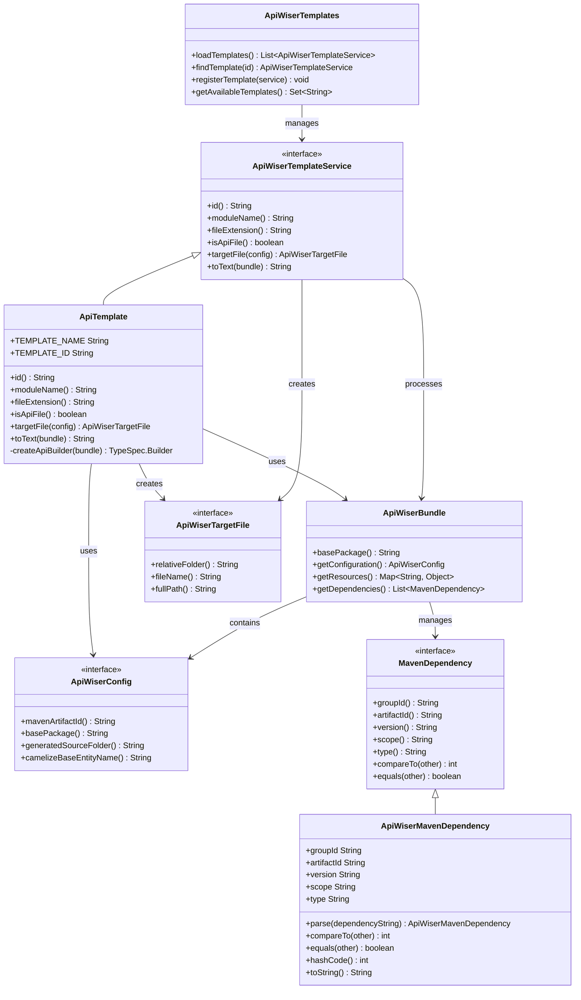

# api-wiser-template-api - API Wiser Template API

## Overview

The `api-wiser-template-api` module serves as the foundational API layer for the API Wiser template system. This module defines the core interfaces, contracts, and utility classes that enable the generation of API code from templates. It provides a standardized way to handle Maven dependencies, template services, and configuration management within the API Wiser ecosystem.

## Key Features

- **Template Service Interface**: Defines the contract for template services
- **Maven Dependency Management**: Handles Maven dependency parsing and comparison
- **Configuration Management**: Provides configuration interfaces for template generation
- **Template Bundle Management**: Manages template resources and bundles
- **Code Generation Support**: Supports various file types and API generation patterns

## Core Components

### Template Services

#### `ApiWiserTemplateService`
The main interface that defines the contract for all template services in the system.

**Key Methods:**
- `id()`: Returns unique template identifier
- `moduleName()`: Returns the module name for the template
- `fileExtension()`: Specifies the file extension for generated files
- `isApiFile()`: Indicates if the template generates API files
- `targetFile(ApiWiserConfig config)`: Defines the target file structure
- `toText(ApiWiserBundle bundle)`: Converts template to text output

#### `ApiTemplate`
A concrete implementation of `ApiWiserTemplateService` that generates API files.

**Template Configuration:**
- Template Name: `"api"`
- Template ID: `"api-wiser::api"`
- File Extension: Java files
- Generates API-specific code structure

### Configuration Management

#### `ApiWiserConfig`
An interface providing configuration information for the API Wiser system.

**Configuration Parameters:**
- Maven artifact information
- Base package structure
- Generated source folder paths
- Entity naming conventions

### Dependency Management

#### `MavenDependency`
Interface representing Maven dependencies with standard attributes:
- `groupId`: Maven group identifier
- `artifactId`: Maven artifact identifier
- `version`: Dependency version
- `scope`: Dependency scope
- `type`: Dependency type

#### `ApiWiserMavenDependency`
Concrete implementation providing:
- Dependency string parsing
- Dependency comparison logic
- Standard Maven dependency operations

### Template Resources

#### `ApiWiserBundle`
Represents a bundle of resources for API Wiser templates, containing:
- Base package information
- Template-specific configurations
- Resource management utilities

#### `ApiWiserTemplates`
Utility class providing:
- Template discovery and loading
- Template registry management
- Common template operations

## Essential Class Diagram

